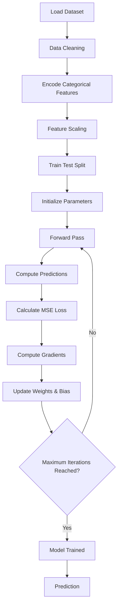

# Linear Regression From Scratch

> A complete implementation of **Linear Regression** using **Gradient Descent** from scratch with **NumPy**.  
> No machine learning libraries are used for training the model (Later sklearn and PyTorch for comparison)

---

## Project Structure

```text
Linear Regression/
│
├── dataset/
│
├── notebook/
│   └── linear_regression.ipynb
│
├── visualizations/
│   ├── weights_plot.html
│   └── training_animation.html
│
└── README.md
```

## Project Structure
For derivation and explanation, see 'Exaplanation & Derivations' PDF


---

# Algorithm Workflow



---

# Future Improvements

- Mini-Batch Gradient Descent
- Stochastic Gradient Descent (SGD)
- Ridge Regression (L2 Regularization)
- Lasso Regression (L1 Regularization)
- Elastic Net
- Learning Rate Scheduling
- Early Stopping
