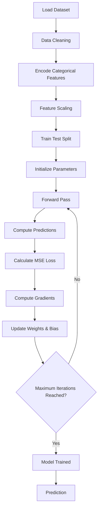

# Linear Regression From Scratch

> A complete implementation of **Linear Regression** using **Gradient Descent** from scratch with **NumPy**.  
> No machine learning libraries are used for training the model (Later sklearn and PyTorch for comparison)

---

## Overview

This project demonstrates how Linear Regression works internally by implementing every step manually—from preprocessing the dataset to optimizing the model using Gradient Descent.

The objective is to understand the mathematics behind the algorithm rather than relying on high-level libraries like scikit-learn.

---

## Features

- Data Preprocessing
- Missing Value Handling
- Duplicate Removal
- Categorical Encoding
- Feature Scaling
- Train/Test Split
- Linear Regression from Scratch
- Mean Squared Error (MSE)
- Batch Gradient Descent
- Model Evaluation
- Interactive Training Visualizations using Plotly

---

## Project Structure

```text
Linear Regression/
│
├── dataset/
│
├── notebook/
│   └── linear_regression.ipynb
│
├── visualizations/
│   ├── weights_plot.html
│   └── training_animation.html
│
├── DERIVATION.md
└── README.md
```

---

# Algorithm Workflow



---

# Mathematical Formulation

## Hypothesis Function

$$
\hat y = Xw+b
$$

---

## Mean Squared Error

$$
J(w,b)=\frac1m\sum_{i=1}^{m}(y_i-\hat y_i)^2
$$

---

## Gradients

For a complete mathematical derivation, see **DERIVATION.md**.

---

# Implementation

| Method | Description |
|---------|-------------|
| `fit()` | Trains the model using Batch Gradient Descent |
| `predict()` | Predicts target values |
| `mean_squared_error()` | Computes the Mean Squared Error |

---

# Visualizations

The repository contains interactive visualizations generated during training.

| Visualization | Description |
|---------------|-------------|
| Loss Curve | Shows the decrease in MSE during training |
| Weight Convergence | Tracks how each feature weight evolves |
| Training Animation | Actual vs Predicted values throughout training |

---

# Future Improvements

- Mini-Batch Gradient Descent
- Stochastic Gradient Descent (SGD)
- Ridge Regression (L2 Regularization)
- Lasso Regression (L1 Regularization)
- Elastic Net
- Learning Rate Scheduling
- Early Stopping
